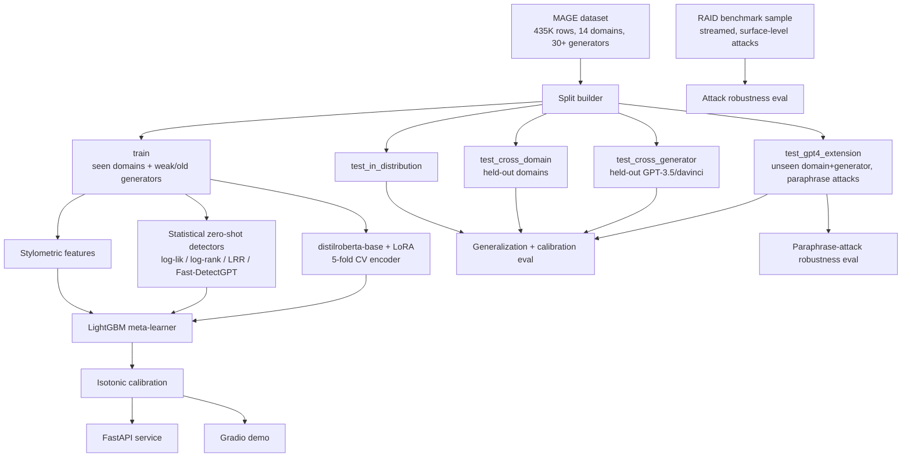

# AI Text Forensics

Machine-generated text detection, built as a deliberately more rigorous
successor to a toy Kaggle pairwise-classification project. Instead of "which
of these two texts is real" on ~100 labeled examples, this trains and
evaluates a detector on a 400K+ row, 14-domain, 30+ generator benchmark
(MAGE), and — the part almost no student project does — measures whether it
**actually generalizes** to unseen domains, unseen LLMs, and adversarial
paraphrase/obfuscation attacks, rather than just reporting a single
in-distribution accuracy number.

## Why this exists

The starting point was [`FakeTextDetector-NLP`](https://github.com/Sonith-Bingi/FakeTextDetector-NLP),
a solution to Kaggle's "Fake or Real: The Impostor Hunt" (a RoBERTa cross-encoder
+ LightGBM blend on stylometric/perplexity features, trained on a few dozen
labeled text pairs). That pipeline is architecturally reasonable but the
*problem itself* is toy-scale: tiny dataset, one narrow domain, no check for
whether the model generalizes beyond exactly what it was trained on.

This project keeps the same spirit (encoder + zero-shot statistical signal +
stylometry, blended and calibrated) but rebuilds it around a real research
benchmark and adds the engineering and evaluation rigor a production system
would actually need.

## Architecture



## What makes this "advanced" rather than a bigger toy

1. **Held-out generalization by construction, not luck.** `train` only ever
   sees 8 of MAGE's 10 original domains and excludes the strongest
   instruction-tuned generators (gpt-3.5-turbo, text-davinci-002/003). Every
   evaluation slice is drawn exclusively from MAGE's own `test` partition, so
   there's no document-level leakage. See `src/forensics/data/splits.py`.
2. **A genuinely multi-signal ensemble, not just a bigger transformer.** The
   encoder, the statistical zero-shot detectors (which need zero training
   data), and the stylometric features fail in different, largely
   uncorrelated ways — that's the actual reason to blend them, not just
   "more features are better."
3. **Two independent adversarial robustness checks**, not zero: MAGE's own
   GPT-4-paraphrase subset (semantic paraphrase evasion) and a curated,
   streamed sample from the RAID benchmark (Dugan et al., 2024) covering
   character/surface-level obfuscation attacks (homoglyphs, whitespace
   insertion, synonym substitution, case scrambling, ...).
4. **Calibration, not just accuracy.** Isotonic regression on out-of-fold
   predictions + Expected Calibration Error, because "70% confidence" should
   mean 70% empirically, not just rank-order correctly.
5. **Interpretability**: SHAP feature attribution on the blender (which
   signal family actually drove a prediction) and gradient-based token
   saliency on the encoder (which words/spans it focused on).
6. **Production surface**: FastAPI service, Docker/Compose, GitHub Actions CI,
   pytest suite, and a Gradio demo — not just a training notebook.

## Modeling stack

| Component | What it is | Why |
|---|---|---|
| **Encoder** | `distilroberta-base` + LoRA (peft), 5-fold CV | LoRA trains a small fraction of params, fast enough on Apple MPS for full CV in minutes; fold adapters ensemble for free at inference. (DeBERTa-v3 was the original choice — see [Engineering detours](#engineering-detours-worth-knowing-about) for why it was swapped.) |
| **Statistical detectors** | Log-likelihood, log-rank, LRR ([Su et al. 2023](https://arxiv.org/abs/2306.05540)), Fast-DetectGPT curvature ([Bao et al. 2024](https://arxiv.org/abs/2310.05130)) via `distilgpt2` | Zero-shot, training-free, mechanistically different failure modes than the encoder |
| **Stylometric features** | Entropy, burstiness, sentence-length variance, repetition rate, readability, TTR | Cheap, fast, and still informative even when the other two disagree |
| **Meta-learner** | LightGBM, 5-fold CV, stacked on encoder logit + all features | Combines signals; isotonic calibration on OOF predictions |

## Dataset

[MAGE](https://huggingface.co/datasets/yaful/MAGE) (Li et al., 2024): 435K
deduplicated rows across 10 original domains (Reddit CMV/ELI5, HellaSwag,
ROCStories, SciGen, SQuAD, TLDR, WritingPrompts, XSum, Yelp) × ~28 generators
(GPT-2/3/3.5/davinci sizes, LLaMA 7-65B, OPT family, GPT-J/NeoX, T0, FLAN-T5,
BLOOM, GLM-130B), plus a bonus test-only extension: 4 more domains (CNN,
DialogSum, IMDB, PubMed) generated by GPT-4, including GPT-4-paraphrased
variants of both human and machine text.

Adversarial robustness stretch goal additionally streams a curated ~1,000-row
sample from [RAID](https://raid-bench.xyz/) (Dugan et al., 2024) covering 9
attack types on generators MAGE never included (gpt2, mistral, mpt-chat) —
pulled via HuggingFace's streaming reader so the full 11.8GB file is never
downloaded.

## Project layout

```
src/forensics/
  config.py                  central config (paths, seeds, hyperparameters)
  data/                       MAGE download+schema, split builder, RAID sampler
  features/                   stylometric + statistical detector feature extraction
  models/                     LoRA encoder, LightGBM blender + calibration
  evaluation/                 metrics, calibration (ECE), generalization suite,
                               paraphrase-attack + RAID-attack robustness
  interpret/                  SHAP explanations, token saliency
  serving/                    FastAPI app + pydantic schemas
  inference.py                shared predict() used by API and demo
  pipeline.py                 disk-cached end-to-end orchestration
scripts/                      CLI entrypoints (download_data / train / evaluate / interpret)
demo/app.py                   Gradio demo
docker/                       Dockerfile + docker-compose.yml
tests/                        pytest suite
.github/workflows/ci.yml      lint + test on push
```

## Running it

```bash
python3.11 -m venv .venv && source .venv/bin/activate
pip install -e ".[dev]"

export PYTHONPATH=src
python scripts/download_data.py   # MAGE + RAID sample, cached to data/
python scripts/train.py           # features -> 5-fold encoder CV -> blender + calibration
python scripts/evaluate.py        # generalization + calibration + both robustness suites
python scripts/interpret.py       # SHAP global feature importance
python demo/app.py                # Gradio demo at http://localhost:7860

uvicorn forensics.serving.api:app --reload   # API at http://localhost:8000
# or: docker compose -f docker/docker-compose.yml up --build
```

Every expensive stage (feature extraction, encoder training, encoder/blender
inference) is disk-cached under `artifacts/` and `data/`, so re-running any
script after an interruption resumes rather than recomputing from scratch.

## Results

Full numbers in `artifacts/results/full_evaluation_report.json`. Trained on a
20K-row subsample (5-fold CV, `distilroberta-base` + LoRA, 2 epochs) — see
[Engineering detours](#engineering-detours-worth-knowing-about) for why that
model and those row counts, not DeBERTa-v3/384 tokens/20K rows as originally
planned.

**Blending beats any single signal.** Encoder alone (OOF): 84.2% accuracy.
Full blend (encoder + stylometric + statistical detectors, calibrated): **93.7%**
OOF accuracy on the training distribution.

**Generalization (the actual point of this project):**

| Eval slice | Accuracy | F1 | ROC-AUC | ECE |
|---|---|---|---|---|
| In-distribution | 86.7% | 0.860 | 0.977 | 0.101 |
| Cross-domain (yelp/sci_gen held out) | 83.7% | 0.847 | 0.936 | 0.090 |
| Cross-generator (gpt-3.5-turbo/davinci held out) | 80.4% | 0.638 | 0.908 | 0.129 |
| GPT-4, unseen domain *and* generator | 71.3% | 0.721 | 0.795 | 0.166 |

Each row is a harder, more honest question than the last. Cross-domain barely
costs anything (the model isn't just memorizing Reddit-post style). Cross-generator
is where it actually hurts — F1 drops from 0.86 to 0.64, meaning the model is
noticeably worse at *recall* on the strongest instruction-tuned generators it
never trained on, even though overall accuracy looks fine (the eval set is
generator-imbalanced). Stacking both an unseen domain and an unseen generator
compounds this to a real, honest 71% — a materially harder problem than the
86.7% in-distribution number would suggest, and exactly the gap a single
reported accuracy would hide.

**Adversarial robustness — two independent attack families:**

*MAGE's built-in GPT-4 paraphrase attack* (semantic paraphrasing, no extra
dataset needed):
| Condition | Detection/accuracy |
|---|---|
| GPT-4 direct generation (clean) | 72.5% caught |
| GPT-4 generation, then paraphrased | **21.8% caught** |
| Human text (clean) | 70.0% correctly ID'd as human |
| Human text, LLM-paraphrased | 19.8% correctly ID'd as machine-touched |

Paraphrasing is a devastating evasion attack here — machine detection collapses
from 72.5% to 21.8%, consistent with published findings that paraphrase attacks
are the most effective known evasion technique against learned detectors. The
paraphrased-human result reads the opposite way: light LLM editing of human
text mostly still looks human to this detector (only 19.8% flagged as
machine-touched) — arguably reasonable behavior, but also a labeling-convention
tension worth knowing about (MAGE counts *any* LLM-touched text as "machine").

*RAID's surface/character-level attacks* (streamed sample, models never seen
in training):
| Attack | Accuracy | Note |
|---|---|---|
| none (clean) | 87.3% | baseline |
| alternative_spelling | 86.0% | negligible cost |
| upper_lower | 81.3% | small cost |
| synonym | 79.3% | small cost |
| whitespace | 74.7% | moderate cost |
| homoglyph | 71.3% | **34/75 machine texts evade detection** (human accuracy unaffected) |
| zero_width_space | 52.7% | **near-collapse — but from 71/75 human texts false-flagged as machine, not from machine evasion** |

The two worst attacks fail in opposite ways: homoglyphs (visually-identical
Unicode substitutions) let machine text slip past undetected, while zero-width
space injection instead wrecks the *human* class — the invisible characters
apparently read as anomalous enough to the stylometric/statistical features
that clean human writing gets misclassified as machine-touched. Same accuracy
collapse, completely different failure mode, only visible by reading the
confusion matrix rather than the headline accuracy number.

**Interpretability (SHAP, in-distribution test set):** the top feature isn't
the encoder — it's `ttr` (lexical type-token ratio), followed by the encoder's
own probability/logit, then `stat_curvature` (Fast-DetectGPT). The blend is
earning its keep: a cheap stylometric feature computed with zero model
inference outweighs the fine-tuned transformer's own output in the final
prediction.

## Engineering detours worth knowing about

Two non-obvious failures cost most of the build time and are worth recording
so nobody re-discovers them the hard way:

1. **DeBERTa-v3's disentangled attention has no optimized kernel on PyTorch's
   MPS backend.** The original plan (DeBERTa-v3-small, 384-token sequences)
   projected 12+ hours for 5-fold CV on an M5 after a short benchmark with
   trivially short sequences underestimated real-document cost by ~100x.
   Switching to `distilroberta-base` (standard attention, hits MPS's optimized
   SDPA path) cut this to ~35 minutes for the same CV. Lesson: benchmark
   training throughput with real, full-length documents before committing to
   an architecture on Apple Silicon, not a short synthetic sentence.
2. **PyTorch and LightGBM/SHAP each bundle their own OpenMP runtime**, and
   running LightGBM training, `Booster.predict()`, or `shap.TreeExplainer` in
   the same process as an already-imported `torch` segfaults on this machine.
   `KMP_DUPLICATE_LIB_OK` alone does not fix it; pinning `OMP_NUM_THREADS=1`
   process-wide (see `config.py`) does, at no measurable cost given the
   dataset sizes here.

## Honest limitations

- Trained on a laptop-scale subsample (20K rows) of MAGE for iteration speed,
  not the full 319K-row training partition — accuracy would improve with the
  full set and more compute.
- The statistical detectors use `distilgpt2` as the scoring model; larger
  scoring models generally improve Fast-DetectGPT-style curvature separation.
- RAID robustness numbers come from a ~1,000-row streamed sample, not RAID's
  full benchmark protocol or leaderboard submission format.
- This detects *distributional* signatures of LLM generation; it is not
  forensic proof for any single document, and determined adversaries (heavy
  human editing, adversarial fine-tuning) will erode accuracy further than
  what's measured here.
