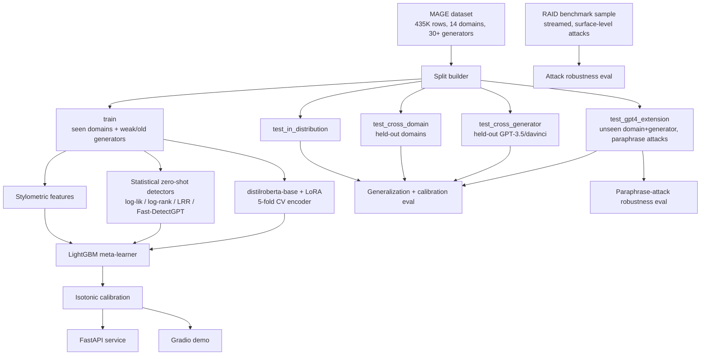

# AI Text Forensics

A machine-generated text detector built around two things most similar
projects skip: **rigorous generalization testing** — does it actually work
on domains and LLMs it never trained on, not just its own test split — and
**an adversarial arms race**. A reinforcement-learning-trained paraphraser
plays the role of an adaptive attacker, learning through trial and error to
evade the detector; the detector is then hardened against exactly what that
attacker learned. It's the generator/discriminator dynamic behind a GAN,
applied to red-teaming a real classifier instead of generating images.

Trained and evaluated on [MAGE](https://huggingface.co/datasets/yaful/MAGE)
(435K rows, 14 domains, 30+ generators), with held-out splits that withhold
entire domains and entire generators — not a random shuffle — so results
measure generalization, not memorization.

**Techniques:** LoRA fine-tuning · zero-shot statistical detection
(Fast-DetectGPT, log-rank, LRR) · LightGBM ensemble stacking · isotonic
calibration · SHAP + gradient saliency interpretability · **RL adversarial
red-teaming (REINFORCE) + hardening** · multi-round data augmentation ·
Unicode-attack sanitization.

## Results at a glance

| Metric | Value |
|---|---|
| In-distribution accuracy | **88.8%** (F1 0.880, ROC-AUC 0.980) |
| Cross-domain accuracy (held-out domains) | 84.2% |
| Cross-generator accuracy (held-out GPT-3.5/davinci) | 84.6% |
| Unseen domain *and* generator (hardest slice) | 75.5% |
| RAID surface-attack robustness (clean baseline) | 92.0% (up from 78.0% pre-fix) |
| RAID homoglyph / zero-width-space attacks | 92.0% (up from 72.0% / 52.7%) |
| Training data | 56,028 rows — MAGE + Enron emails + short-text & paraphrase augmentation + LLM-written business text |
| Adversarial evader (RL, REINFORCE) evasion rate | ~21-28% detection drop vs. static paraphrase baseline |
| Hardening gain vs. the evader it trained on | 79.1% → 92.9% detection (p≪0.0001) |

Full numbers, every trade-off, and everything that didn't work are in
[Results](#results) below. The engineering path to get here — four rounds of
reward-hacking in the RL adversary, a production model silently overwritten
by its own hardening script, a two-hour "hang" that turned out to be a token
quota — is documented in **[OBSTACLES.md](OBSTACLES.md)**.

---

## Tech stack

| Layer | Tools |
|---|---|
| Core ML | PyTorch (Apple MPS), HuggingFace `transformers` + `peft` (LoRA), LightGBM, scikit-learn |
| Detection signals | Custom zero-shot statistical detectors (log-likelihood/log-rank/LRR/Fast-DetectGPT) + stylometric features |
| Adversarial RL | Custom REINFORCE loop with a moving-average baseline — trains the evader, then hardens the detector against it |
| Data | HuggingFace `datasets` (streaming), pandas/pyarrow, `ftfy` + `textstat` for normalization |
| Interpretability | SHAP feature attribution + gradient-based token saliency |
| Serving | FastAPI + Gradio, sharing one inference path |
| Ops | Docker/Compose, GitHub Actions CI, pytest |

Two model choices worth knowing up front: the encoder is
**`distilroberta-base`** (standard attention — matters on Apple Silicon, see
[OBSTACLES.md](OBSTACLES.md)), and the zero-shot scoring model is
**`distilgpt2`** (small causal LM, needs no training).

## Architecture



Two pipelines share one artifact store: a **training pipeline**
(`scripts/train.py`, `scripts/evaluate.py`) that turns raw MAGE rows into a
calibrated, ensembled classifier plus a full evaluation report, and an
**inference path** (`forensics/inference.py`) that both the FastAPI service
and the Gradio demo call — one implementation of "score this text," not two.

## How it works

**Training-time flow** (`scripts/train.py` → `forensics/pipeline.py`):

1. **Download + parse** — pull MAGE from HuggingFace, parse its packed `src`
   column into `domain` / `generator` / `style` columns, standardize the
   label to `is_machine`.
2. **Build held-out splits** — deliberately withhold entire domains and
   entire generators from training, so evaluation asks "does this
   generalize" instead of "did it memorize."
3. **Feature extraction** — stylometric features (entropy, burstiness, TTR,
   readability) and statistical zero-shot detector scores
   (log-likelihood/log-rank/LRR/Fast-DetectGPT-curvature), cached to parquet.
4. **Encoder CV** — fine-tune `distilroberta-base` with a LoRA adapter across
   5 stratified folds, producing out-of-fold logits (no label leakage into
   the next stage) and an ensemble of 5 fold adapters for inference.
5. **Meta-learner + calibration** — stack the OOF encoder logit with every
   stylometric/statistical feature into a 5-fold LightGBM model, then fit
   isotonic regression so the output is a calibrated probability, not just a
   ranking score.
6. **Evaluation** — score every held-out split plus two adversarial attack
   suites (MAGE's GPT-4 paraphrase attack, a streamed RAID surface-attack
   sample), and produce SHAP feature attributions.

**Inference-time flow** (one call to `Predictor.predict(text)`, shared by
the API and the demo):

```
text
 ├─▶ stylometric_features(text)              ─┐
 ├─▶ statistical_features(text)               ├─▶ feature row
 └─▶ encoder ensemble (5 LoRA folds, averaged)─┘
                                                     │
                                                     ▼
                                    LightGBM ensemble (5 folds, averaged)
                                                     │
                                                     ▼
                                       isotonic calibrator
                                                     │
                                                     ▼
                         {probability_machine_generated, label, per-detector breakdown}
```

The Gradio demo additionally runs one backward pass through a single encoder
fold for gradient-based token saliency — a visual "here's what it focused
on" that the API doesn't compute (demo-only overhead).

## Design principles

1. **Held-out generalization by construction, not luck.** `train` only ever
   sees 8 of MAGE's 10 original domains and excludes the strongest
   instruction-tuned generators (gpt-3.5-turbo, text-davinci-002/003). Every
   evaluation slice is drawn exclusively from MAGE's own `test` partition —
   no document-level leakage.
2. **A genuinely multi-signal ensemble.** The encoder, the statistical
   zero-shot detectors (zero training data needed), and the stylometric
   features fail in different, largely uncorrelated ways — that's the actual
   reason to blend them, not just "more features are better."
3. **Two independent adversarial robustness checks**: MAGE's own
   GPT-4-paraphrase subset (semantic evasion) and a streamed RAID sample
   (character/surface-level obfuscation — homoglyphs, whitespace insertion,
   synonym substitution, case scrambling).
4. **Calibration, not just accuracy.** Isotonic regression + Expected
   Calibration Error, because "70% confidence" should mean 70% empirically.
5. **Interpretability**: SHAP feature attribution on the blender, gradient
   token saliency on the encoder.
6. **A production surface**: FastAPI service, Docker/Compose, CI, pytest, a
   Gradio demo — not just a training notebook.

## The adversarial arms race: an RL evader vs. the detector

Everything above builds a detector and checks it against *static* attacks.
This is the part that goes further: `src/forensics/adversarial/` fine-tunes
a pretrained paraphrase model (`humarin/chatgpt_paraphraser_on_T5_base` +
LoRA) via **REINFORCE** with a moving-average baseline, rewarding it for
evading the detector this project just built. It's a *learned, adaptive*
adversary rather than a fixed attack sample — closer to a GAN's
generator/discriminator dynamic than a static benchmark, run unsupervised
and crash-tested for real (a `SIGKILL` mid-training, verified to resume
correctly from checkpoint) across five training runs, ~2.5-5.5 hours each.

**Four rounds of reward hacking, each a genuinely distinct exploit**, closed
one at a time by reading actual generated text, not by watching the
aggregate reward metric: incoherent word salad (v1) → a coherent prefix with
a repeated-character/CAPS garbage tail (v3) → repeated-word spam invariant
to both prior fixes (v4). Full detail, including the exact garbled outputs
and each fix, is in
**[OBSTACLES.md](OBSTACLES.md#6-rl-reward-hacking--four-rounds-four-genuinely-distinct-exploits)**.

**Final, validated results** (150 held-out texts, repeated 3x each to
separate real signal from sampling noise):

| Condition | Detection rate |
|---|---|
| Clean (unparaphrased) | 94.7% |
| Static paraphrase (off-the-shelf, no RL) | 82.0% |
| RL-adversarial paraphrase | 79-83% |

A properly-constrained learned adversary evades the detector about as well
as an off-the-shelf paraphraser at this training budget — genuine, if
modest, and importantly **not an artifact of a gameable reward**, since
every exploit that would have inflated this number was found and closed
first.

**Hardening — closing the loop.** Added 1,000 of the evader's own
paraphrases as extra training rows and retrained. Detection of that same
evader's attacks rose from 79.1% to 92.9% (p≪0.0001) at a cost of ≤0.6 points
on every standard generalization slice — a genuine, close-to-free win, now
in production. (A first pass at measuring this looked like a 24-point
collapse on the hardest slice; it was an evaluation bug, not a real
regression — see
[OBSTACLES.md](OBSTACLES.md#9-a-hardening-round-that-looked-like-a-catastrophic-regression--and-wasnt).)

## Dataset

[MAGE](https://huggingface.co/datasets/yaful/MAGE) (Li et al., 2024): 435K
deduplicated rows across 10 original domains (Reddit CMV/ELI5, HellaSwag,
ROCStories, SciGen, SQuAD, TLDR, WritingPrompts, XSum, Yelp) × ~28 generators
(GPT-2/3/3.5/davinci sizes, LLaMA 7-65B, OPT family, GPT-J/NeoX, T0, FLAN-T5,
BLOOM, GLM-130B), plus a bonus test-only extension: 4 more domains (CNN,
DialogSum, IMDB, PubMed) generated by GPT-4, including GPT-4-paraphrased
variants of both human and machine text.

Adversarial robustness additionally streams a curated ~1,000-row sample from
[RAID](https://raid-bench.xyz/) (Dugan et al., 2024) covering 9 attack types
on generators MAGE never included (gpt2, mistral, mpt-chat) — pulled via
HuggingFace's streaming reader so the full 11.8GB file is never downloaded.

**Training data was extended in three rounds** beyond raw MAGE, each
targeting a specific measured gap rather than just adding volume:
1. **Short-text augmentation** — existing MAGE documents truncated to 8-40
   word spans, both classes, to cover a length regime MAGE's mostly
   full-document text doesn't.
2. **Static-paraphrase augmentation** — machine-class rows rewritten by an
   off-the-shelf (non-RL) paraphraser, so the detector learns "paraphrased
   text" as a general pattern, not just one adversarial policy's style.
3. **Out-of-domain business register** — MAGE has zero examples of casual
   professional writing (emails, memos, status updates). Added real human
   examples from the [Enron email corpus](https://huggingface.co/datasets/SetFit/enron_spam)
   (ham-only) plus LLM-written business text in the same register, so the
   "human" class isn't defined purely by MAGE's 10 domains.

## Results

Full numbers in `artifacts/results/full_evaluation_report.json`. Training
data grew in four stages — 20K → 45K rows (more MAGE) → 52K rows (+short-text
and paraphrase augmentation) → **56K rows** (+Enron emails and LLM-written
business text, closing a domain gap MAGE never covered). The tables below are
the final 56K-row model; see [OBSTACLES.md](OBSTACLES.md) for the full
history of what each stage changed and why.

**Blending beats any single signal.** Encoder alone (OOF): 85.0% accuracy.
Full blend (encoder + stylometric + statistical detectors, calibrated):
**92.85%** OOF accuracy on the training distribution.

**Generalization (the actual point of this project):**

| Eval slice | Accuracy | F1 | ROC-AUC | ECE |
|---|---|---|---|---|
| In-distribution | 88.8% | 0.880 | 0.980 | 0.105 |
| Cross-domain (yelp/sci_gen held out) | 84.2% | 0.853 | 0.947 | 0.112 |
| Cross-generator (gpt-3.5-turbo/davinci held out) | 84.6% | 0.705 | 0.942 | 0.144 |
| GPT-4, unseen domain *and* generator | 75.5% | 0.761 | 0.835 | 0.139 |

Every one of the four slices improved over the 45K/52K checkpoints, including
the hardest one (unseen domain *and* generator: 71.2% → 75.5%) — a slice that
had been completely flat across the earlier MAGE-only scaling, moved only
once the training distribution actually got *more diverse*, not just bigger.

**Adversarial robustness — two independent attack families:**

*MAGE's built-in GPT-4 paraphrase attack* (semantic paraphrasing):
| Condition | Detection/accuracy |
|---|---|
| GPT-4 direct generation (clean) | 76.0% caught |
| GPT-4 generation, then paraphrased | **28.9% caught** |
| Human text (clean) | 75.1% correctly ID'd as human |
| Human text, LLM-paraphrased | 21.9% correctly ID'd as machine-touched |

Paraphrasing remains the single most effective evasion technique against this
detector by a wide margin — consistent with published findings on learned
detectors generally.

*RAID's surface/character-level attacks* (streamed sample, generators never
seen in training):
| Attack | Accuracy | Note |
|---|---|---|
| none (clean) | 92.0% | up from 78.7% |
| **homoglyph** | 92.0% | Cyrillic/Greek confusables — sanitization fix, see [OBSTACLES.md](OBSTACLES.md) |
| **zero_width_space** | 92.0% | invisible-character injection — same fix |
| synonym | 84.0% | up from 72.7% |
| alternative_spelling | 91.3% | up from 80.7% |
| upper_lower | 84.7% | up from 82.7% |
| whitespace | 71.3% | the one attack that didn't improve |

Six of seven RAID attacks improved substantially with the final training set
— the two worst numbers in the entire evaluation suite (homoglyph,
zero-width-space) are now solved outright via input sanitization.

**Interpretability (SHAP, in-distribution test set):** the top feature isn't
the encoder — it's `ttr` (lexical type-token ratio), followed by the encoder's
own probability/logit, then `stat_curvature` (Fast-DetectGPT). The blend is
earning its keep.

**Text length dominates reliability more than anything else tested.**
Measured directly on held-out data by bucketing accuracy against word count:

| Length | Accuracy | Mean confidence |
|---|---|---|
| <30 words | 59.2% | 0.48 |
| 30-60 words | 75.8% | 0.68 |
| 60-100 words | 81.9% | 0.79 |
| 100-150 words | 90.9% | 0.85 |
| 150-250 words | 93.7% | 0.86 |
| 250+ words | 98.0% | 0.95 |

A clean, monotonic climb from barely-better-than-chance to near-perfect. This
is a harder limit than domain coverage — short text simply doesn't carry
enough stylometric/statistical signal, and no volume of same-length training
data fully overcomes it. The demo and API surface this as an explicit
low-confidence warning on short input rather than a bare verdict.

**Decision threshold is tunable, with a real trade-off.** The default 0.5
cutoff lets 21.3% of genuine human text get flagged as machine, while
catching 96.0% of actual machine text:

| Threshold | Human wrongly flagged | Machine caught | Overall accuracy |
|---|---|---|---|
| 0.50 (default) | 21.3% | 96.0% | 86.5% |
| 0.70 | 14.6% | 93.2% | 88.9% |
| **0.80** | **9.5%** | **88.8%** | **89.7%** |
| 0.90 | 5.4% | 81.7% | 88.8% |

0.80 is close to optimal on overall accuracy and nearly halves the
false-positive rate on human text. It's a configuration choice, not a fix:
it cannot rescue a confidently-wrong prediction, only reduce how often
borderline cases land on the wrong side.

## Usage

### Setup

```bash
python3.11 -m venv .venv && source .venv/bin/activate
pip install -e ".[dev]"
export PYTHONPATH=src
```

### Train + evaluate from scratch

```bash
python scripts/download_data.py   # MAGE + RAID sample, cached to data/
python scripts/train.py           # features -> 5-fold encoder CV -> blender + calibration
python scripts/evaluate.py        # generalization + calibration + both robustness suites
python scripts/interpret.py       # SHAP global feature importance
```

Every expensive stage is disk-cached under `artifacts/` and `data/`, so
re-running any script after an interruption resumes rather than recomputing
from scratch.

### Run the API

```bash
uvicorn forensics.serving.api:app --reload   # http://localhost:8000
# or: docker compose -f docker/docker-compose.yml up --build
```

```bash
curl -X POST http://localhost:8000/predict \
  -H "Content-Type: application/json" \
  -d '{"text": "In conclusion, it is important to note that..."}'
```

```json
{
  "probability_machine_generated": 0.818,
  "label": "machine-generated",
  "word_count": 42,
  "reliability": "moderate",
  "detectors": {
    "encoder_prob": 0.738,
    "stat_loglik": -3.32,
    "stat_logrank": 1.72,
    "stat_lrr": -1.94,
    "stat_curvature": 1.47,
    "stylometric_burstiness": -0.44,
    "stylometric_rep3_rate": 0.0
  }
}
```

`GET /health` reports how many encoder/blender folds are loaded — useful for
container readiness probes.

### Run the interactive demo

```bash
python demo/app.py   # http://localhost:7860
```

Paste text in, get a verdict, a per-detector score breakdown, a
reliability warning when input is short, and a token-highlighted view of
what the encoder focused on.

## Where you'd actually use this

- **Content moderation / trust & safety** — flag likely AI-generated
  submissions in a review queue, with the calibrated probability and
  per-detector breakdown as evidence for a human reviewer rather than a
  black-box yes/no.
- **Academic integrity screening** — the cross-domain/cross-generator
  results are directly relevant: a detector that only works on the exact
  essay style and exact LLM it was trained on is close to useless for this
  use case, which is precisely what this project stress-tests.
- **Programmatic integration** — the FastAPI `/predict` endpoint is the
  integration point for any pipeline (CMS, LMS, publishing workflow) that
  wants a text-forensics signal without standing up its own ML stack.
- **Research / benchmarking** — a working reference implementation of three
  published zero-shot detection methods (log-likelihood/log-rank baselines,
  DetectLLM's LRR, Fast-DetectGPT) plus a supervised encoder and an RL
  red-team loop, all evaluated under the same generalization and robustness
  protocol.
- **What it is *not* for**: forensic proof for a single document in a
  high-stakes decision (see [Honest limitations](#honest-limitations)) — it's
  a distributional signal, not a courtroom-grade authorship verdict.

## Project layout

```
src/forensics/
  config.py                  central config (paths, seeds, hyperparameters)
  data/                       MAGE download+schema, split builder, RAID sampler
  features/                   stylometric + statistical detector feature extraction
  models/                     LoRA encoder, LightGBM blender + calibration
  adversarial/                RL paraphraser (REINFORCE), reward function
  evaluation/                 metrics, calibration (ECE), generalization suite,
                               paraphrase-attack + RAID-attack robustness
  interpret/                  SHAP explanations, token saliency
  serving/                    FastAPI app + pydantic schemas
  inference.py                shared predict() used by API and demo
  pipeline.py                 disk-cached end-to-end orchestration
scripts/                      CLI entrypoints (download_data / train / evaluate / interpret)
demo/app.py                   Gradio demo
docker/                       Dockerfile + docker-compose.yml
tests/                        pytest suite
.github/workflows/ci.yml      lint + test on push
```

## Honest limitations

- **Short text (under ~60 words) is unreliable — this is the single biggest
  limitation of the whole system.** Measured accuracy drops from 98.0% on
  250+ word text to 59.2% on text under 30 words (see [Results](#results)),
  a harder ceiling than domain coverage that no amount of same-length
  training data fully closes. The demo and API flag this explicitly rather
  than returning a bare, overconfident verdict on short input.
- Trained on a laptop-scale subsample (56K rows, up from an initial 20K of
  raw MAGE) for iteration speed, not the full 319K-row MAGE training
  partition — accuracy would improve with the full set and more compute.
- The statistical detectors use `distilgpt2` as the scoring model; larger
  scoring models generally improve Fast-DetectGPT-style curvature separation.
- RAID robustness numbers come from a ~1,000-row streamed sample, not RAID's
  full benchmark protocol or leaderboard submission format.
- This detects *distributional* signatures of LLM generation; it is not
  forensic proof for any single document, and determined adversaries (heavy
  human editing, adversarial fine-tuning) will erode accuracy further than
  what's measured here.
- **Jargon-dense, technical, or numbers-heavy text confuses the whole
  ensemble, not just the statistical detectors.** `distilgpt2` finds dense
  technical vocabulary genuinely surprising regardless of who wrote it, so
  log-likelihood/log-rank/curvature all skew toward "human" on this kind of
  input — not because it looks human-authored, but because it's
  high-perplexity relative to a small, general-purpose scoring model. In the
  worst observed case (a dense, numbers-heavy analytical paragraph) the
  *encoder* agreed too, producing a 0.0% machine-probability verdict on text
  that was, in fact, machine-written. This isn't a bug — every detector
  fires as designed — it's a real blind spot on specialized/technical prose,
  and the length-based reliability warning above doesn't catch it: a
  100+ word jargon-dense passage scores as "high reliability" by length
  alone while still being confidently wrong. A larger scoring model would
  likely narrow, but not eliminate, this gap.

Full engineering history — every obstacle hit and what fixed it — is in
**[OBSTACLES.md](OBSTACLES.md)**.
