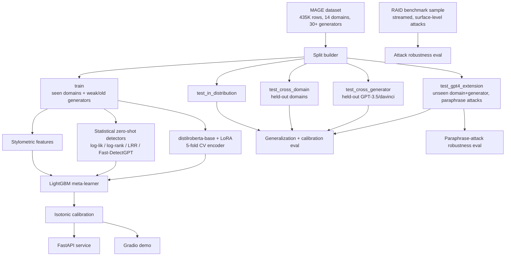

# AI Text Forensics

Machine-generated text detection, built as a deliberately more rigorous
successor to a toy Kaggle pairwise-classification project. Instead of "which
of these two texts is real" on ~100 labeled examples, this trains and
evaluates a detector on a 400K+ row, 14-domain, 30+ generator benchmark
(MAGE), and — the part almost no student project does — measures whether it
**actually generalizes** to unseen domains, unseen LLMs, and adversarial
paraphrase/obfuscation attacks, rather than just reporting a single
in-distribution accuracy number.

---

## Table of contents

- [Motivation](#motivation)
- [Tech stack](#tech-stack)
- [Architecture](#architecture)
- [How it works (flow)](#how-it-works-flow)
- [What makes this "advanced" rather than a bigger toy](#what-makes-this-advanced-rather-than-a-bigger-toy)
- [Dataset](#dataset)
- [Usage](#usage)
- [Where you'd actually use this](#where-youd-actually-use-this)
- [Project layout](#project-layout)
- [Results](#results)
- [Engineering detours worth knowing about](#engineering-detours-worth-knowing-about)
- [Honest limitations](#honest-limitations)

---

## Motivation

The starting point was [`FakeTextDetector-NLP`](https://github.com/Sonith-Bingi/FakeTextDetector-NLP),
a solution to Kaggle's "Fake or Real: The Impostor Hunt" — a RoBERTa
cross-encoder blended with LightGBM on stylometric/perplexity features,
trained on a few dozen labeled text *pairs* (given two texts, pick the real
one). That pipeline's modeling choices were architecturally reasonable, but
the *problem itself* was toy-scale in three specific ways:

1. **Tiny, single-domain data.** Dozens of labeled examples from one Kaggle
   competition, not a benchmark anyone else could compare against.
2. **No generalization check.** A model trained and tested on the same narrow
   distribution tells you nothing about whether it learned "AI-generated
   text" or just "this specific competition's texts."
3. **No adversarial check.** Nobody asked "does this survive someone trying
   to fool it" — which, for a detector whose entire purpose is adversarial
   (people actively want to evade AI-text detection), is close to the only
   question that matters.

This project keeps the same *spirit* — encoder + zero-shot statistical
signal + stylometry, blended and calibrated, LightGBM stacking — but rebuilds
it around a real research benchmark (MAGE, 435K rows / 14 domains / 30+
generators) and adds the evaluation rigor and engineering surface a system
that had to actually be trusted would need: held-out generalization splits,
calibration, two independent adversarial robustness suites, interpretability,
and a real serving layer instead of a training notebook.

## Tech stack

| Layer | Tools | Purpose |
|---|---|---|
| Language / packaging | Python 3.11, `pyproject.toml`, `venv` | Project baseline |
| Deep learning | PyTorch (Apple MPS backend), HuggingFace `transformers` | Encoder fine-tuning and inference |
| Parameter-efficient fine-tuning | `peft` (LoRA) | Trains a small fraction of the encoder's parameters — fast on a laptop, small checkpoints |
| Gradient boosting | LightGBM | Meta-learner that stacks all signal families |
| Classical ML / calibration | scikit-learn | Cross-validation splitting, isotonic calibration, metrics (ROC-AUC, PR-AUC, F1) |
| Data | HuggingFace `datasets`, `pandas`, `pyarrow`/parquet | Streaming dataset access, tabular processing, disk caching |
| NLP utilities | `ftfy`, `textstat`, `emoji` | Text normalization, readability scoring |
| Interpretability | `shap` | Feature-attribution explanations for the meta-learner |
| Serving | FastAPI, `uvicorn`, `pydantic` | Production HTTP API |
| Demo | Gradio | Interactive browser UI with live explanations |
| Experiment/eval tracking | Plain JSON + `matplotlib` | Results reports, reliability diagrams |
| Containerization | Docker, Docker Compose | Reproducible deployment |
| CI / quality | GitHub Actions, `pytest`, `ruff` | Lint + test on every push |

Two specific model choices worth knowing up front:
- **Encoder:** `distilroberta-base` (standard multi-head attention — this
  matters on Apple Silicon; see [Engineering detours](#engineering-detours-worth-knowing-about))
- **Zero-shot scoring model:** `distilgpt2` (small causal LM used purely to
  compute log-likelihood/log-rank/curvature — no training required)

## Architecture



The system is really two pipelines sharing one artifact store:

- **A training pipeline** (`scripts/train.py`, `scripts/evaluate.py`) that
  turns raw MAGE rows into a calibrated, ensembled classifier plus a full
  evaluation report.
- **An inference path** (`forensics/inference.py`) that both the FastAPI
  service and the Gradio demo call — one implementation of "score this text,"
  not two.

## How it works (flow)

**Training-time flow** (`scripts/train.py` → `forensics/pipeline.py`):

1. **Download + parse** — `data/download.py` pulls MAGE from HuggingFace,
   `data/schema.py` parses its packed `src` column (e.g.
   `yelp_machine_continuation_opt_13b`) into `domain` / `generator` / `style`
   columns and standardizes the label to `is_machine`.
2. **Build held-out splits** — `data/splits.py` deliberately withholds entire
   domains and entire generators from training (not just a random shuffle),
   so later evaluation can ask "does this generalize" instead of "did it
   memorize."
3. **Feature extraction** — `features/cache.py` computes, for every row in
   every split, (a) stylometric features (entropy, burstiness, TTR,
   readability, ...) and (b) statistical zero-shot detector scores
   (log-likelihood/log-rank/LRR/Fast-DetectGPT-curvature via `distilgpt2`),
   caching the result to parquet so re-runs don't recompute it.
4. **Encoder CV** — `models/encoder.py` fine-tunes `distilroberta-base` with a
   LoRA adapter across 5 stratified folds, producing out-of-fold (OOF) logits
   on `train` (needed so the next stage never sees leaked labels) and an
   ensemble of 5 fold adapters for inference.
5. **Meta-learner + calibration** — `models/blender.py` stacks the OOF
   encoder logit together with every stylometric/statistical feature into a
   5-fold LightGBM model, then fits isotonic regression on the OOF blended
   probabilities so the final output is a calibrated probability, not just a
   ranking score.
6. **Evaluation** — `evaluation/` runs the trained pipeline against every
   held-out split (in-distribution, cross-domain, cross-generator,
   unseen-domain-and-generator) plus two adversarial attack suites (MAGE's
   built-in GPT-4 paraphrase attack, and a streamed RAID surface-attack
   sample), and `interpret/` produces SHAP feature attributions.

**Inference-time flow** (one call to `Predictor.predict(text)` in
`forensics/inference.py`, shared by the API and the demo):

```
text
 ├─▶ stylometric_features(text)              ─┐
 ├─▶ statistical_features(text)               ├─▶ feature row
 └─▶ encoder ensemble (5 LoRA folds, averaged)─┘
                                                     │
                                                     ▼
                                    LightGBM ensemble (5 folds, averaged)
                                                     │
                                                     ▼
                                       isotonic calibrator
                                                     │
                                                     ▼
                         {probability_machine_generated, label, per-detector breakdown}
```

The Gradio demo additionally runs one backward pass through a single encoder
fold to compute gradient-based token saliency — a visual "here's what it
focused on" that the API intentionally doesn't compute (it's demo-only
overhead, not needed for a programmatic response).

## What makes this "advanced" rather than a bigger toy

1. **Held-out generalization by construction, not luck.** `train` only ever
   sees 8 of MAGE's 10 original domains and excludes the strongest
   instruction-tuned generators (gpt-3.5-turbo, text-davinci-002/003). Every
   evaluation slice is drawn exclusively from MAGE's own `test` partition, so
   there's no document-level leakage. See `src/forensics/data/splits.py`.
2. **A genuinely multi-signal ensemble, not just a bigger transformer.** The
   encoder, the statistical zero-shot detectors (which need zero training
   data), and the stylometric features fail in different, largely
   uncorrelated ways — that's the actual reason to blend them, not just
   "more features are better."
3. **Two independent adversarial robustness checks**, not zero: MAGE's own
   GPT-4-paraphrase subset (semantic paraphrase evasion) and a curated,
   streamed sample from the RAID benchmark (Dugan et al., 2024) covering
   character/surface-level obfuscation attacks (homoglyphs, whitespace
   insertion, synonym substitution, case scrambling, ...).
4. **Calibration, not just accuracy.** Isotonic regression on out-of-fold
   predictions + Expected Calibration Error, because "70% confidence" should
   mean 70% empirically, not just rank-order correctly.
5. **Interpretability**: SHAP feature attribution on the blender (which
   signal family actually drove a prediction) and gradient-based token
   saliency on the encoder (which words/spans it focused on).
6. **Production surface**: FastAPI service, Docker/Compose, GitHub Actions CI,
   pytest suite, and a Gradio demo — not just a training notebook.

## Dataset

[MAGE](https://huggingface.co/datasets/yaful/MAGE) (Li et al., 2024): 435K
deduplicated rows across 10 original domains (Reddit CMV/ELI5, HellaSwag,
ROCStories, SciGen, SQuAD, TLDR, WritingPrompts, XSum, Yelp) × ~28 generators
(GPT-2/3/3.5/davinci sizes, LLaMA 7-65B, OPT family, GPT-J/NeoX, T0, FLAN-T5,
BLOOM, GLM-130B), plus a bonus test-only extension: 4 more domains (CNN,
DialogSum, IMDB, PubMed) generated by GPT-4, including GPT-4-paraphrased
variants of both human and machine text.

Adversarial robustness stretch goal additionally streams a curated ~1,000-row
sample from [RAID](https://raid-bench.xyz/) (Dugan et al., 2024) covering 9
attack types on generators MAGE never included (gpt2, mistral, mpt-chat) —
pulled via HuggingFace's streaming reader so the full 11.8GB file is never
downloaded.

## Usage

### Setup

```bash
python3.11 -m venv .venv && source .venv/bin/activate
pip install -e ".[dev]"
export PYTHONPATH=src
```

### Train + evaluate from scratch

```bash
python scripts/download_data.py   # MAGE + RAID sample, cached to data/
python scripts/train.py           # features -> 5-fold encoder CV -> blender + calibration
python scripts/evaluate.py        # generalization + calibration + both robustness suites
python scripts/interpret.py       # SHAP global feature importance
```

Every expensive stage (feature extraction, encoder training, encoder/blender
inference) is disk-cached under `artifacts/` and `data/`, so re-running any
script after an interruption resumes rather than recomputing from scratch.

### Run the API

```bash
uvicorn forensics.serving.api:app --reload   # http://localhost:8000
# or: docker compose -f docker/docker-compose.yml up --build
```

```bash
curl -X POST http://localhost:8000/predict \
  -H "Content-Type: application/json" \
  -d '{"text": "In conclusion, it is important to note that..."}'
```

```json
{
  "probability_machine_generated": 0.818,
  "label": "machine-generated",
  "detectors": {
    "encoder_prob": 0.738,
    "stat_loglik": -3.32,
    "stat_logrank": 1.72,
    "stat_lrr": -1.94,
    "stat_curvature": 1.47,
    "stylometric_burstiness": -0.44,
    "stylometric_rep3_rate": 0.0
  }
}
```

`GET /health` reports how many encoder/blender folds are loaded — useful for
container readiness probes.

### Run the interactive demo

```bash
python demo/app.py   # http://localhost:7860
```

Paste text in, get a verdict, a per-detector score breakdown, and a
token-highlighted view of what the encoder focused on.

## Where you'd actually use this

- **Content moderation / trust & safety** — flag likely AI-generated
  submissions in a review queue, with the calibrated probability and
  per-detector breakdown as evidence for a human reviewer rather than a
  black-box yes/no.
- **Academic integrity screening** — the cross-domain/cross-generator
  results are directly relevant here: a detector that only works on the
  exact essay style and exact LLM it was trained on is close to useless for
  this use case, which is precisely what this project stress-tests.
- **Programmatic integration** — the FastAPI `/predict` endpoint is the
  integration point for any pipeline (CMS, LMS, publishing workflow) that
  wants a text-forensics signal without standing up its own ML stack.
- **Research / benchmarking** — the codebase is a working reference
  implementation of three published zero-shot detection methods
  (log-likelihood/log-rank baselines, DetectLLM's LRR, Fast-DetectGPT) plus a
  supervised encoder, all evaluated under the same generalization and
  robustness protocol — useful as a starting point for comparing new
  detection ideas apples-to-apples.
- **What it is *not* for**: forensic proof for a single document in a
  high-stakes decision (see [Honest limitations](#honest-limitations)) — it's
  a distributional signal, not a courtroom-grade authorship verdict.

## Project layout

```
src/forensics/
  config.py                  central config (paths, seeds, hyperparameters)
  data/                       MAGE download+schema, split builder, RAID sampler
  features/                   stylometric + statistical detector feature extraction
  models/                     LoRA encoder, LightGBM blender + calibration
  evaluation/                 metrics, calibration (ECE), generalization suite,
                               paraphrase-attack + RAID-attack robustness
  interpret/                  SHAP explanations, token saliency
  serving/                    FastAPI app + pydantic schemas
  inference.py                shared predict() used by API and demo
  pipeline.py                 disk-cached end-to-end orchestration
scripts/                      CLI entrypoints (download_data / train / evaluate / interpret)
demo/app.py                   Gradio demo
docker/                       Dockerfile + docker-compose.yml
tests/                        pytest suite
.github/workflows/ci.yml      lint + test on push
```

## Results

Full numbers in `artifacts/results/full_evaluation_report.json`. Trained on a
20K-row subsample (5-fold CV, `distilroberta-base` + LoRA, 2 epochs) — see
[Engineering detours](#engineering-detours-worth-knowing-about) for why that
model and those row counts, not DeBERTa-v3/384 tokens/20K rows as originally
planned.

**Blending beats any single signal.** Encoder alone (OOF): 84.2% accuracy.
Full blend (encoder + stylometric + statistical detectors, calibrated): **93.7%**
OOF accuracy on the training distribution.

**Generalization (the actual point of this project):**

| Eval slice | Accuracy | F1 | ROC-AUC | ECE |
|---|---|---|---|---|
| In-distribution | 86.7% | 0.860 | 0.977 | 0.101 |
| Cross-domain (yelp/sci_gen held out) | 83.7% | 0.847 | 0.936 | 0.090 |
| Cross-generator (gpt-3.5-turbo/davinci held out) | 80.4% | 0.638 | 0.908 | 0.129 |
| GPT-4, unseen domain *and* generator | 71.3% | 0.721 | 0.795 | 0.166 |

Each row is a harder, more honest question than the last. Cross-domain barely
costs anything (the model isn't just memorizing Reddit-post style). Cross-generator
is where it actually hurts — F1 drops from 0.86 to 0.64, meaning the model is
noticeably worse at *recall* on the strongest instruction-tuned generators it
never trained on, even though overall accuracy looks fine (the eval set is
generator-imbalanced). Stacking both an unseen domain and an unseen generator
compounds this to a real, honest 71% — a materially harder problem than the
86.7% in-distribution number would suggest, and exactly the gap a single
reported accuracy would hide.

**Adversarial robustness — two independent attack families:**

*MAGE's built-in GPT-4 paraphrase attack* (semantic paraphrasing, no extra
dataset needed):
| Condition | Detection/accuracy |
|---|---|
| GPT-4 direct generation (clean) | 72.5% caught |
| GPT-4 generation, then paraphrased | **21.8% caught** |
| Human text (clean) | 70.0% correctly ID'd as human |
| Human text, LLM-paraphrased | 19.8% correctly ID'd as machine-touched |

Paraphrasing is a devastating evasion attack here — machine detection collapses
from 72.5% to 21.8%, consistent with published findings that paraphrase attacks
are the most effective known evasion technique against learned detectors. The
paraphrased-human result reads the opposite way: light LLM editing of human
text mostly still looks human to this detector (only 19.8% flagged as
machine-touched) — arguably reasonable behavior, but also a labeling-convention
tension worth knowing about (MAGE counts *any* LLM-touched text as "machine").

*RAID's surface/character-level attacks* (streamed sample, models never seen
in training):
| Attack | Accuracy | Note |
|---|---|---|
| none (clean) | 87.3% | baseline |
| alternative_spelling | 86.0% | negligible cost |
| upper_lower | 81.3% | small cost |
| synonym | 79.3% | small cost |
| whitespace | 74.7% | moderate cost |
| homoglyph | 71.3% | **34/75 machine texts evade detection** (human accuracy unaffected) |
| zero_width_space | 52.7% | **near-collapse — but from 71/75 human texts false-flagged as machine, not from machine evasion** |

The two worst attacks fail in opposite ways: homoglyphs (visually-identical
Unicode substitutions) let machine text slip past undetected, while zero-width
space injection instead wrecks the *human* class — the invisible characters
apparently read as anomalous enough to the stylometric/statistical features
that clean human writing gets misclassified as machine-touched. Same accuracy
collapse, completely different failure mode, only visible by reading the
confusion matrix rather than the headline accuracy number.

**Interpretability (SHAP, in-distribution test set):** the top feature isn't
the encoder — it's `ttr` (lexical type-token ratio), followed by the encoder's
own probability/logit, then `stat_curvature` (Fast-DetectGPT). The blend is
earning its keep: a cheap stylometric feature computed with zero model
inference outweighs the fine-tuned transformer's own output in the final
prediction.

## Engineering detours worth knowing about

Two non-obvious failures cost most of the build time and are worth recording
so nobody re-discovers them the hard way:

1. **DeBERTa-v3's disentangled attention has no optimized kernel on PyTorch's
   MPS backend.** The original plan (DeBERTa-v3-small, 384-token sequences)
   projected 12+ hours for 5-fold CV on an M5 after a short benchmark with
   trivially short sequences underestimated real-document cost by ~100x.
   Switching to `distilroberta-base` (standard attention, hits MPS's optimized
   SDPA path) cut this to ~35 minutes for the same CV. Lesson: benchmark
   training throughput with real, full-length documents before committing to
   an architecture on Apple Silicon, not a short synthetic sentence.
2. **PyTorch and LightGBM/SHAP each bundle their own OpenMP runtime**, and
   running LightGBM training, `Booster.predict()`, or `shap.TreeExplainer` in
   the same process as an already-imported `torch` segfaults on this machine.
   `KMP_DUPLICATE_LIB_OK` alone does not fix it; pinning `OMP_NUM_THREADS=1`
   process-wide (see `config.py`) does, at no measurable cost given the
   dataset sizes here.

## Honest limitations

- Trained on a laptop-scale subsample (20K rows) of MAGE for iteration speed,
  not the full 319K-row training partition — accuracy would improve with the
  full set and more compute.
- The statistical detectors use `distilgpt2` as the scoring model; larger
  scoring models generally improve Fast-DetectGPT-style curvature separation.
- RAID robustness numbers come from a ~1,000-row streamed sample, not RAID's
  full benchmark protocol or leaderboard submission format.
- This detects *distributional* signatures of LLM generation; it is not
  forensic proof for any single document, and determined adversaries (heavy
  human editing, adversarial fine-tuning) will erode accuracy further than
  what's measured here.
- **Jargon-dense, technical, or list-style text confuses the statistical
  detectors specifically.** `distilgpt2` (82M params, general web text) finds
  dense technical vocabulary genuinely surprising regardless of who wrote it,
  so log-likelihood/log-rank/curvature all skew toward "human" on this kind of
  input — not because it looks human-authored, but because it's high-perplexity
  relative to a small, general-purpose scoring model. Concretely: feeding this
  README's own bullet-point section descriptions (dense with jargon like
  "distilroberta-base", "LoRA", "moderation queues") back into the demo gets
  called human-written at ~85% confidence. This isn't a bug in the pipeline —
  every detector fires as designed — it's a real blind spot of small-LM-based
  zero-shot detection on specialized/technical prose, and input in this style
  (bullet lists, architecture docs) is also outside every domain MAGE was
  trained on. A larger scoring model would likely narrow, but not eliminate,
  this gap.
